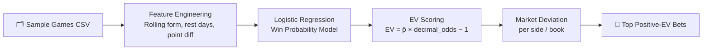

<div align="center">

# 🏀 AI-Driven NBA Value Betting System

[](https://www.python.org/)
[](https://scikit-learn.org/)
[]()
[]()

*A small, resume-ready demo of an end-to-end NBA value betting workflow — from raw game data to positive-EV bet detection across 5 sportsbooks.*

</div>

---

## 📖 Overview

This project implements an NBA value betting pipeline using historical game data and sportsbook odds. It uses logistic regression to estimate win probabilities, then converts those into **expected value (EV) scores** and **market deviation signals** to surface potentially mispriced lines.

Ships with offline sample data (Lakers-centric) but is structured to scale to 1,000+ games and live odds feeds.

---

## ✨ Project Highlights

| | |
|---|---|
| 🔁 **End-to-end ML pipeline** | Ingest → feature build → model train → odds scoring |
| 📈 **Positive-EV detection** | Converts model win probs to EV and flags bets above 0 |
| 📊 **Market sanity check** | Deviation from average odds per side/book across 5 sportsbooks |
| 🔌 **Live-data ready** | Easy to swap in live feeds via `balldontlie` helper and your own odds source |

---

## 🚀 Quickstart

```bash
python3 -m venv .venv
source .venv/bin/activate
pip install -r requirements.txt

# 1) Build features from sample games
python src/app.py prepare

# 2) Train the win-probability model
python src/app.py train

# 3) Score sample odds and print top value bets
python src/app.py score --top 5
```

---

## 🧬 Pipeline at a Glance



Orchestrated via CLI (`src/app.py`) with subcommands: `prepare`, `train`, `score`.

| Step | File |
|---|---|
| Ingest sample games | `data/sample/games_sample.csv` |
| Build rolling team form features | `src/features/build_features.py` |
| Train logistic regression on home-win target | `src/model/train.py` → `models/winprob_logreg.pkl` |
| Score sportsbook lines, compute EV + market deviation | `src/ev/ev.py` |

---

## 🗂️ Repo Structure

```
├── src/
│   ├── app.py              # CLI entrypoint: prepare / train / score
│   ├── features/           # Rolling team form + matchup feature builder
│   ├── model/              # Training and model persistence
│   ├── ev/                 # Expected value and market deviation utilities
│   └── ingest/             # Sample loaders + balldontlie API stub
├── data/
│   └── sample/
│       ├── games_sample.csv   # date, home_team, away_team, home_score, away_score
│       └── odds_sample.csv    # date, team, opponent, home_away, book, decimal_odds
├── models/                 # Saved model artifacts (created after training)
└── requirements.txt
```

---

## 🔌 Extending to Real Data

<details>
<summary><strong>Games</strong> — swap in live historical data</summary>

`src/ingest/balldontlie.py` includes a helper to fetch historical games (no API key required). Swap it into `cmd_prepare` or pre-save to `data/processed`.

</details>

<details>
<summary><strong>Odds</strong> — hook up your own odds feed</summary>

Point any API or scraper that outputs the same columns as `data/sample/odds_sample.csv` at the `score` command, then rerun. No other changes needed.

</details>

<details>
<summary><strong>Features</strong> — customize the model inputs</summary>

Adjust the rolling window with `--window` on `prepare`, or add new columns (Elo ratings, injuries, pace stats) directly inside `build_features.py`.

</details>

---

## ⚙️ Notes

- **Python 3.11+** recommended. All dependencies in `requirements.txt`.
- Everything runs **fully offline** with the bundled CSVs — swapping to live data only requires aligning your source to the schemas above.
